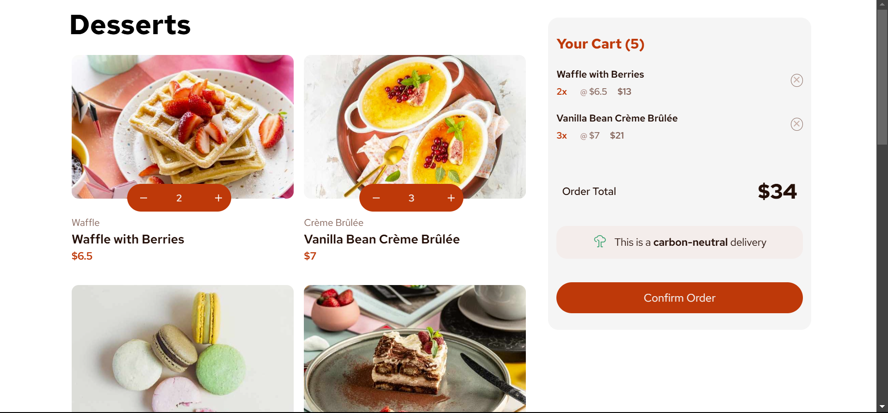

# Frontend Mentor - Product list with cart solution

This is a solution to the [Product list with cart challenge on Frontend Mentor](https://www.frontendmentor.io/challenges/product-list-with-cart-5MmqLVAp_d). Frontend Mentor challenges help you improve your coding skills by building realistic projects. 

## Table of contents

- [Overview](#overview)
  - [The challenge](#the-challenge)
  - [Screenshot](#screenshot)
  - [Links](#links)
- [My process](#my-process)
  - [Built with](#built-with)
  - [What I learned](#what-i-learned)
  - [Continued development](#continued-development)
  - [Useful resources](#useful-resources)
- [Author](#author)
- [Acknowledgments](#acknowledgments)


## Overview

### The challenge

Users should be able to:

- Add items to the cart and remove them
- Increase/decrease the number of items in the cart
- See an order confirmation modal when they click "Confirm Order"
- Reset their selections when they click "Start New Order"
- View the optimal layout for the interface depending on their device's screen size
- See hover and focus states for all interactive elements on the page

### Screenshot




### Links

- [Solution URL](https://www.frontendmentor.io/solutions/responsive-product-list-with-cart-using-react-t9efgyOB9W)
- [Live Site URL](https://dessertsfront.netlify.app/)

## My process

For this project, I followed the mobile-first workflow, where I created the following components:
- `App.jsx`
- `Desserts.jsx`
- `Dessert.jsx`
- `Cart.jsx`
- `FilledCart.jsx`
- `OrderConfirmation.jsx`

in `Desserts.jsx`, I mapped over the data in the `data.json` file (which is an array of objects) and passed each object as a prop to `Dessert.jsx`:

`Desserts.jsx`:
```jsx
import Dessert from "./Dessert"
import data from '../../data.json'
const Desserts = (props) => {
  return (
    <div className='desserts-component'>
        <h1 className="desserts-title red-hat-text">Desserts</h1>
        {data.map((entry) => {
            return <Dessert 
                    key={entry.category} 
                    image={entry.image}
                    name={entry.name}
                    category={entry.category}
                    price={entry.price}
                    handleSelectButton={props.handleSelectButton}
                    />
        })}
    </div>
  )
}
export default Desserts
```
And this is how I structured the `Dessert.jsx` component (with a possibility of changing it later):

`Dessert.jsx`:
```jsx
import AddToCart from './AddToCart'
const Dessert = (props) => {
    return (
    <div className='dessert red-hat-text'>
      
      <div className="dessert-button">
        <AddToCart />
        <button onClick={() => props.handleSelectButton({name: props.name, price: props.price})} className='add-to-cart-btn'>Add to Cart</button>
      </div>
      <div className="dessert-category">{props.category}</div>
      <div className="dessert-name">{props.name}</div>
      <div className="dessert-price">${props.price}</div>
    </div>
  )
}

export default Dessert 

```

- Since the user would click the "Add to Cart" button to add items to the cart, the first thing I thought of while handling this was conditional rendering, the empty cart would only be rendered if the user did not add any items to it, so I initialized an array state along with its state updater function `cartItems` and `setCartItems` respectively, then passed a function `handleClickButton` from the parent component `App.jsx` down to the component that held the "Add to Cart" button, which is `Dessert.jsx`. 
- So when the button is clicked, the name and price of the selected item will be passed to `handleClickButton` function, which will then push the object (`{name: props.name, price: props.price}`) to the `cartItems` array:
`Dessert.jsx`:
```jsx
<button onClick={() => props.handleSelectButton({name: props.name, price: props.price})} className='add-to-cart-btn'>Add to Cart</button>
```
`App.jsx`:
```jsx
const [cartItems, setCartItems] = useState([]);
const handleSelectButton = (item) => {
  setCartItems(prevCartItems => [...prevCartItems, item])
}
```

I created another component, named `FilledCart`, this would be the component that held items the user added to the cart.
- So I modified the `App.jsx` component to include it:
```jsx
import FilledCart from "./components/FilledCart" 
...
return (
  <div className='main-component'>
    <Desserts handleSelectButton={handleSelectButton}/>
    {cartItems.length === 0 ? <Cart /> : <FilledCart items={cartItems}/> }
  </div>
)
...
```
I also passed `cartItems` to `FilledCart` component, I then initialized a variable named `itemsCount` that would represent an array of objects, each object is an individual item with `name`, `price` and `count` as its properties, where `count` is how many times the item has been added to the cart.
```jsx
let itemsCount = [];
  props.items.forEach((item) => {
    let existingItem = itemsCount.find(element => element.name === item.name)
    if (existingItem) {
      existingItem.count++;
    } else {
      itemsCount.push({name: item.name, price: item.price, count: 1})
    }
  })
```
Then I rendered each item along with its `name`, `price` and `count` properties:
```jsx
<div className="items-added-list">
  {itemsCount.map((entry) => (
    <div key={entry.name} className="added-single-item">
      <div className="single-item-info">
        <h3 className='single-item-title'>{entry.name}</h3>
        <div className="pricing-single-item">
          <span className='single-item-count'>{`${entry.count}x`}</span>
          <span className='single-item-price'>{`@ $${entry.price}`}</span>
          <span className='single-item-total'>{`$${entry.price*entry.count}`}</span>
        </div>
      </div>
      <button className="remove-item-btn"><RemoveItem /></button>      
    </div>
  ))}
</div>
```
So `FilledCart.jsx` was as follows: 
```jsx
import RemoveItem from "./RemoveItem";
const FilledCart = (props) => {
  let itemsCount = [];
  props.items.forEach((item) => {
    let existingItem = itemsCount.find(element => element.name === item.name)
    if (existingItem) {
      existingItem.count++;
    } else {
      itemsCount.push({name: item.name, price: item.price, count: 1})
    }
  })
  return (
    <div className='filled-cart  red-hat-text'>
      <h1 className='filled-cart-title'>{`Your Cart (${props.items.length})`}</h1>
      <div className="items-added-list">
        {itemsCount.map((entry) => (
          <div key={entry.name} className="added-single-item">
            <div className="single-item-info">
              <h3 className='single-item-title'>{entry.name}</h3>
              <div className="pricing-single-item">
                <span className='single-item-count'>{`${entry.count}x`}</span>
                <span className='single-item-price'>{`@ $${entry.price}`}</span>
                <span className='single-item-total'>{`$${entry.price*entry.count}`}</span>
              </div>
            </div>
            <RemoveItem />           
          </div>
        ))}
      </div>
    </div>
  )
}
export default FilledCart
```
With `RemoveItem` being an svg component.

At some point after I created `FilledCart.jsx`, I realized that I need to handle the count of added items in a parent component, i.e., `App.jsx` so I could pass that state (`cartItems`) down to components that would use it, such as `Dessert.jsx`

`App.jsx`:
```jsx
import Desserts from "./components/Desserts"
import Cart from "./components/Cart"
import FilledCart from "./components/FilledCart"
import { useState } from "react";
const App = () => {
  const [cartItems, setCartItems] = useState([]);
  const handleSelectButton = (item) => {
    setCartItems((prevCartItems) => {
      let existingItem = prevCartItems.find(element => element.name === item.name)
        if (existingItem) {
            return prevCartItems.map(element => 
              element.name === item.name
              ? {...element, count: element.count++}
              : element
            )
        } else {
            return [...prevCartItems, {...item, count: 1}];
        }
    });
  }
  return (
    <div className='main-component'>
      <Desserts handleSelectButton={handleSelectButton} />
      {cartItems.length === 0 ? <Cart /> : <FilledCart items={cartItems} />}
    </div>
  )
}
export default App
```
I modified the code in `FilledCart.jsx`:
```jsx
import RemoveItem from "./RemoveItem";
import CarbonNeutral from "./CarbonNeutral";
const FilledCart = (props) => {
    const totalPrice = props.items.reduce(
        (acc, currentValue) => acc + (currentValue.price * currentValue.count), 0)
    let totalCount = props.items.reduce(
        (acc, currentValue) => acc + currentValue.count, 0)
    return (
      <div className='filled-cart red-hat-text'>
        <h1 className='filled-cart-title'>{`Your Cart (${totalCount})`}</h1>
        <div className="items-added-list">
            {props.items.map((entry) => (
                <div key={entry.name} className="added-single-item">
                    <div className="single-item-info">
                        <h3 className='single-item-title'>{entry.name}</h3>
                        <div className="pricing-single-item">
                            <span className='single-item-count'>{`${entry.count}x`}</span>
                            <span className='single-item-price'>{`@ $${entry.price}`}</span>
                            <span className='single-item-total'>{`$${entry.price*entry.count}`}</span>
                        </div>
                    </div>
                    <button className="remove-item-btn"><RemoveItem /></button>           
                </div>
            ))}
        </div>
        <div className="order-total-container">
            <p className="order-total-text">Order Total</p>
            <p className="order-total-amount">${totalPrice}</p>
        </div>
        <div className="carbon-neutral-container">
            <span className="carbon-neutral-icon"><CarbonNeutral /></span>
            <p className="carbon-neutral-text">This is a <span className="to-bold">carbon-neutral</span> delivery</p>
        </div>
        <button className="confirm-order-btn">Confirm Order</button>
      </div>
    )
}
export default FilledCart
```

I passed the `cartItems` array down to `Dessert.jsx` to properly display the "Add to Cart" button or "Decrement {count} Increment" buttons based on whether the item has a count greater than 0.
`Dessert.jsx`:
```jsx
import AddToCart from './AddToCart'
const Dessert = (props) => {
    const foundItem = props.items.find((item) => item.name === props.name)
    return (
    <div className='dessert red-hat-text'>
      
      <div className="dessert-button">
        <AddToCart />
        { foundItem && foundItem.count > 0 ? (
          <button className='counter-btn'>
          - {foundItem.count} + // just to test if it works
          </button>
        ) : (
          <button 
          onClick={() => props.handleSelectButton({name: props.name, price: props.price})} 
          className='add-to-cart-btn'>Add to Cart
          </button>
        )
        }
      </div>
      <div className="dessert-category">{props.category}</div>
      <div className="dessert-name">{props.name}</div>
      <div className="dessert-price">${props.price}</div>
    </div>
  )
}
export default Dessert
```

I then created the `incrementCount` and `decrementCount` functions in `App.jsx`:
```jsx
...
const incrementCount = (item) => {
    setCartItems((prevCartItems) => {
      return prevCartItems.map(element => 
        element.name === item.name
        ? {...element, count: element.count + 1}
        : element
      )
    })
  }

const decrementCount = (item) => {
  setCartItems((prevCartItems) => {
    return prevCartItems.map(element => 
      element.name === item.name
      ? {...element, count: element.count - 1} 
      : element
    ).filter(element => element.count > 0)
    }
  )
}
...
```
And passed them down to `Dessert.jsx`:
```jsx
...
<div className="dessert-button">
  { foundItem && foundItem.count > 0 ? (
    <div className='counter-btn'>
      <button className='red-hat-text' onClick={() => props.decrementCount(foundItem)}><DecrementSVG /></button> {foundItem.count} <button className='red-hat-text' onClick={() => props.incrementCount(foundItem)}><IncrementSVG /></button>
    </div>
    ) : (
        <div className="add-to-cart-container">
          <AddToCart />
          <button 
            onClick={() => props.handleSelectButton({name: props.name, price: props.price})} 
            className='add-to-cart-btn red-hat-text'>Add to Cart
          </button>
        </div> 
      )
  }
</div>
...
```
I also added the `<picture>` element in `Dessert.jsx` to render the appropriate image based on screen width:
```jsx
...
<picture>
  <source media="min-width: 1024px" srcSet={props.image.desktop} />
  <source media="min-width: 768px" srcSet={props.image.tablet}/>
  
</picture>
...
``` 

I built the function `deleteItem` that's supposed to remove the item from the cart whenever the user clicks the 'X' icon:
`FilledCart.jsx`:
```jsx
...
{props.items.map((entry) => (
  <div key={entry.name} className="added-single-item">
    <div className="single-item-info">
      <h3 className='single-item-title'>{entry.name}</h3>
      <div className="pricing-single-item">
        <span className='single-item-count'>{`${entry.count}x`}</span>
        <span className='single-item-price'><span className="at-sym">@</span>{`$${entry.price}`}</span>
        <span className='single-item-total'>{`$${entry.price*entry.count}`}</span>
      </div>
    </div>
    <div onClick={() => props.deleteItem(entry)} className="remove-item-container"><button className="remove-item-btn"><RemoveItem /></button></div>         
  </div>
))}
...
```

In the same component (`FilledCart.jsx`) I also built the function `handleConfirmation` which tracks a state variable named `isConfirmed`. This state variable is supposed to track whether the user clicked the "Confirm Order" button or not.
`FilledCart.jsx`:
```jsx
...
<div className="carbon-neutral-container">
  <span className="carbon-neutral-icon"><CarbonNeutral /></span>
  <p className="carbon-neutral-text">This is a <span className="to-bold">carbon-neutral</span> delivery</p>
</div>
<button onClick={() => props.handleConfirmation()} className="confirm-order-btn red-hat-text">Confirm Order</button>
...
```

I then created `OrderConfirmation.jsx`, in which I rendered the cart, the total price, and a "Start New Order" button. The button when clicked calls a function `handleNewOrder` which sets the cart to an empty array using `setCartItems` state updater function, and `isConfirmed` back to `false` using `setIsConfirmed` state updater function.
I also used `useEffect()` to control how cart items are displayed without overflowing their container (for a consistent layout). 
`OrderConfirmation.jsx`:
```jsx
import { useEffect } from "react"
import IconConfirmed from "./IconConfirmed"

const OrderConfirmation = (props) => {
    const totalPrice = props.items.reduce(
        (acc, currentValue) => acc + (currentValue.price * currentValue.count), 0)
      
    const handleNewOrder = () => {
      props.setIsConfirmed(false)
      props.setCartItems([])
    }

    useEffect(() => {
      if (props.isConfirmed) {
          document.body.classList.add("no-scroll");
      } else {
          document.body.classList.remove("no-scroll");
      }
      return () => document.body.classList.remove("no-scroll");
    }, [props.isConfirmed]);

  return (
    <div className={`order-confirmation-component red-hat-text ${props.isConfirmed ? "show" : ""}`}>
      <div className="order-confirmation-header">
        <IconConfirmed />
        <h1 className="order-confirmation-title">Order Confirmed</h1>
        <p className="order-confirmation-text">We hope you enjoy your food!</p>
      </div>

      <div className="ordered-items red-hat-text">
        {props.items.map((item) => (
            <div key={item.name} className="single-item">
                <div className="item-info">
                  
                  <div className="pricing-item">
                    <h3 className='item-title'>{item.name}</h3>
                    <div className="price-count">
                      <span className='item-count'>{`${item.count}x`}</span>
                      <span className='item-price'><span className="at-sym">@</span>{`$${item.price}`}</span>
                    </div>
                  </div>
                  <div className='item-total'>{`$${item.price*item.count}`}</div>
                </div> 
            </div>
        ))}
        <div className="order-total-container">
            <p className="order-total-text">Order Total</p>
            <p className="order-total-amount">${totalPrice}</p>
        </div> 
      </div>
      <button onClick={() => handleNewOrder()} className="start-new-order-btn red-hat-text">Start New Order</button>
    </div>
  )
}
export default OrderConfirmation
```

Both of `deleteItem` and `handleConfirmation` were declared in `App.jsx`:
```jsx
const deleteItem = (item) => {
  setCartItems(prevCartItems => {
    return prevCartItems.map((element) => 
      element.name != item.name 
      ? element 
      : null 
    ).filter(element => element != null)
  })
}

const handleConfirmation = () => {
  if (cartItems.length > 0) {
    setIsConfirmed(prevConfirm => !prevConfirm)
  } else {
    return
  }
}
```

### Built with

- Semantic HTML5 markup
- CSS custom properties
- Flexbox
- CSS Grid
- Mobile-first workflow
- [React](https://reactjs.org/) - JS library

### What I learned

During the development of this project, I learned the importance of declaring state variables and their updater functions in the parent component whenever possible. This approach allows me to pass them down to multiple child components, ensuring that all child components derive their state from a single source of truth—the parent component.

### Continued development

This project took me a long time to complete for several reasons, the most significant was the limited amount of work I accomplished each day, which was less than what I was capable of. Additionally, I hadn't yet integrated other technologies. Moving forward, I aim to reduce development time and incorporate other technologies into my projects. 

***Note for future-self***: always move the images used in the project from the src folder to the public folder.

## Author

- GitHub - [@ziad-rima](https://github.com/ziad-rima)
- Frontend Mentor - [@ziad-rima](https://www.frontendmentor.io/profile/ziad-rima)
- X - [@rima4082](https://x.com/rima4082)


